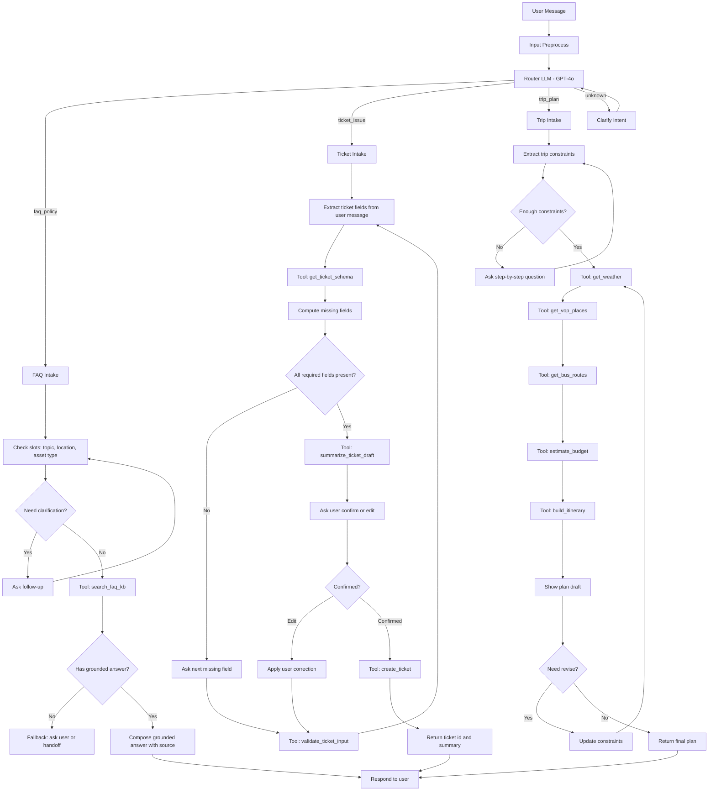

# SPEC — AI Product Hackathon

**Nhóm:** ___
**Track:** ☐ VinFast · ☐ Vinmec · ☐ VinUni-VinSchool · ☐ XanhSM · ☑ Open
 
**Problem statement (1 câu):** Cư dân sống ở Vinhomes thường mất thời gian tìm thông tin nội quy, tiện ích, phí dịch vụ và gửi phản ánh qua nhiều kênh khác nhau; chatbot AI giúp trả lời nhanh các câu hỏi thường gặp, hướng dẫn đúng quy trình và tạo ticket cho ban quản lý khi cần.

---

## 1. AI Product Canvas

|   | Value | Trust | Feasibility |
|---|-------|-------|-------------|
| **Câu hỏi** | User nào? Pain gì? AI giải gì? | Khi AI sai thì sao? User sửa bằng cách nào? | Cost/latency bao nhiêu? Risk chính? |
| **Trả lời** | Cư dân Vinhomes cần hỏi nhanh về nội quy, phí quản lý, đặt tiện ích, gửi phản ánh sửa chữa hoặc an ninh. Hiện tại user phải gọi hotline, nhắn ban quản lý, hỏi group cư dân hoặc tự tìm trong app. AI gom thông tin thành một điểm hỏi đáp, giúp user nhận câu trả lời hoặc tạo yêu cầu hỗ trợ trong vài phút. | Nếu AI sai, user có thể bấm "Không đúng", chọn lý do sai, nhập thông tin sửa lại hoặc yêu cầu gặp nhân viên ban quản lý. Với các câu trả lời liên quan đến phí, an ninh, sự cố khẩn cấp, bot phải dẫn nguồn từ tài liệu chính thức hoặc chuyển sang người thật. | Ước tính 2.000-5.000 VND/100 lượt chat đơn giản, latency mục tiêu <3s cho FAQ và <8s cho tạo ticket. Risk chính: hallucination về phí/nội quy, hiểu sai mức độ khẩn cấp, lộ thông tin cá nhân cư dân, dữ liệu cư dân từng tòa khác nhau. |

**Automation hay augmentation?** ☐ Automation · ☑ Augmentation
 
Justify: Augmentation — chatbot hỗ trợ trả lời, tóm tắt và tạo ticket nháp; user vẫn xác nhận trước khi gửi yêu cầu, còn các case nhạy cảm hoặc khẩn cấp được chuyển cho ban quản lý/con người.

**Learning signal:**

1. User correction đi vào đâu? Correction được lưu vào feedback log theo intent, tòa/cụm cư dân, câu hỏi gốc, câu trả lời bot, lý do user báo sai và câu trả lời đúng do nhân viên xác nhận.
2. Product thu signal gì để biết tốt lên hay tệ đi? Tỷ lệ câu trả lời được user chấp nhận, tỷ lệ chuyển sang nhân viên, thời gian xử lý ticket, tỷ lệ ticket bị phân loại sai, số lần user hỏi lại cùng một vấn đề, CSAT sau mỗi cuộc chat.
3. Data thuộc loại nào? ☑ User-specific · ☑ Domain-specific · ☑ Real-time · ☑ Human-judgment · ☐ Khác: ___
 
   Có marginal value không? Có. Model nền có thể biết tiếng Việt và kiến thức chung, nhưng không biết chính xác nội quy từng khu, trạng thái thang máy/bãi xe, phí dịch vụ, lịch bảo trì, quy trình xử lý của từng ban quản lý và feedback thực tế của cư dân.

---

## 2. User Stories — 4 paths

Mỗi feature chính = 1 bảng. AI trả lời xong → chuyện gì xảy ra?

### Feature 1: Hỏi đáp nội quy, phí dịch vụ và tiện ích cư dân

**Trigger:** User mở chatbot và hỏi: "Phí gửi xe máy ở Vinhomes là bao nhiêu?" hoặc "Hồ bơi mở cửa lúc mấy giờ?"

| Path | Câu hỏi thiết kế | Mô tả |
|------|-------------------|-------|
| Happy — AI đúng, tự tin | User thấy gì? Flow kết thúc ra sao? | Bot nhận diện đúng khu/tòa của cư dân, trả lời mức phí hoặc giờ hoạt động theo tài liệu chính thức, kèm ngày cập nhật và link/quy định liên quan. User có câu trả lời ngay và không cần gọi hotline. |
| Low-confidence — AI không chắc | System báo "không chắc" bằng cách nào? User quyết thế nào? | Bot nói rõ cần thêm thông tin vì mỗi phân khu/tòa có thể khác nhau, hỏi user đang ở khu nào hoặc muốn tra cứu tiện ích nào. User chọn từ danh sách gợi ý, sau đó bot mới trả lời. |
| Failure — AI sai | User biết AI sai bằng cách nào? Recover ra sao? | Bot trả lời nhầm phí hoặc giờ hoạt động của khu khác. User phát hiện vì thông tin không giống thông báo ban quản lý, bấm "Không đúng" và chọn "Sai khu/Sai thời gian/Sai mức phí". Bot xin lỗi, yêu cầu xác nhận khu/tòa và chuyển câu hỏi sang nhân viên nếu chưa có dữ liệu chắc chắn. |
| Correction — user sửa | User sửa bằng cách nào? Data đó đi vào đâu? | User nhập thông tin đúng hoặc gửi ảnh thông báo của ban quản lý. Dữ liệu đi vào correction queue để nhân viên xác minh, sau đó cập nhật knowledge base theo khu/tòa và ghi lại phiên bản tài liệu. |

### Feature 2: Gửi phản ánh và tạo ticket cho ban quản lý

**Trigger:** User nhắn: "Thang máy block A bị kẹt", "Nhà tôi bị rò nước", hoặc "Có xe đậu sai chỗ ở hầm B2".

| Path | Câu hỏi thiết kế | Mô tả |
|------|-------------------|-------|
| Happy — AI đúng, tự tin | User thấy gì? Flow kết thúc ra sao? | Bot phân loại đúng loại sự cố, hỏi thêm thông tin còn thiếu như tòa, tầng, căn hộ, ảnh minh chứng và mức độ khẩn cấp. Bot tạo ticket nháp, user xác nhận, ticket được gửi đến đúng bộ phận như kỹ thuật, an ninh hoặc vệ sinh. |
| Low-confidence — AI không chắc | System báo "không chắc" bằng cách nào? User quyết thế nào? | Nếu câu mô tả mơ hồ như "chỗ này hỏng rồi", bot hỏi lại sự cố thuộc nhóm nào: điện nước, thang máy, an ninh, vệ sinh, bãi xe. User chọn một nhóm hoặc nhập thêm mô tả trước khi bot tạo ticket. |
| Failure — AI sai | User biết AI sai bằng cách nào? Recover ra sao? | Bot phân loại rò nước thành vệ sinh thay vì kỹ thuật, khiến ticket đi sai bộ phận. User thấy màn hình xác nhận trước khi gửi và đổi lại nhóm xử lý. Nếu đã gửi, user có thể bấm "Sửa ticket" hoặc nhân viên tiếp nhận chuyển ticket sang đúng bộ phận. |
| Correction — user sửa | User sửa bằng cách nào? Data đó đi vào đâu? | User chỉnh loại sự cố, mức độ khẩn cấp hoặc vị trí trước khi gửi. Correction được lưu vào ticket log và dùng để cải thiện bộ phân loại intent, đồng thời tạo danh sách các câu mô tả hay bị hiểu sai. |

---

## 3. Eval metrics + threshold

**Optimize precision hay recall?** ☑ Precision · ☐ Recall
 
Tại sao? Chatbot liên quan đến nội quy, phí dịch vụ, an ninh và sự cố cư dân nên trả lời sai tự tin cao sẽ nguy hiểm hơn là không trả lời. Nếu không chắc, bot nên hỏi lại hoặc chuyển sang nhân viên thay vì bịa thông tin.
Nếu sai ngược lại thì chuyện gì xảy ra? Nếu quá ưu tiên precision nhưng recall thấp, bot sẽ chuyển sang nhân viên quá nhiều, làm giảm giá trị tự động hóa và user cảm thấy chatbot không giúp được gì. Vì vậy cần precision cao cho câu trả lời chắc chắn, nhưng vẫn có flow hỏi lại để giữ trải nghiệm.

| Metric | Threshold | Red flag (dừng khi) |
|--------|-----------|---------------------|
| Intent classification accuracy cho FAQ/ticket | ≥85% trong pilot | <75% trong 1 tuần hoặc sai nhiều ở nhóm an ninh/kỹ thuật |
| Answer groundedness: câu trả lời có nguồn từ KB chính thức | ≥95% với câu hỏi về phí, nội quy, quy trình | Bất kỳ câu trả lời nào bịa mức phí, số điện thoại, quy định quan trọng |
| Ticket routing precision | ≥90% ticket vào đúng bộ phận | <80% trong 1 tuần hoặc có ticket khẩn cấp bị phân loại thường |
| Human handoff rate | 20-40% ở giai đoạn pilot | >60% sau 1 tháng, chứng tỏ bot không đủ hữu ích |
| CSAT sau chat | ≥4/5 | <3.5/5 trong 2 tuần liên tục |

---

## 4. Top 3 failure modes

*Liệt kê cách product có thể fail — không phải list features.*
*"Failure mode nào user KHÔNG BIẾT bị sai? Đó là cái nguy hiểm nhất."*

| # | Trigger | Hậu quả | Mitigation |
|---|---------|---------|------------|
| 1 | Cư dân hỏi về phí, nội quy hoặc giờ tiện ích nhưng KB thiếu dữ liệu mới nhất | AI trả lời sai nhưng nghe rất chắc, user làm theo thông tin sai hoặc tranh cãi với ban quản lý | Bắt buộc RAG từ KB chính thức, hiển thị ngày cập nhật, không tìm thấy nguồn thì nói không chắc và chuyển nhân viên |
| 2 | User mô tả sự cố khẩn cấp bằng ngôn ngữ mơ hồ, ví dụ "có mùi khét" hoặc "nước chảy nhiều" | AI đánh giá thấp mức độ khẩn cấp, ticket xử lý chậm, có thể ảnh hưởng an toàn cư dân | Thêm bộ rule nhận diện khẩn cấp, nếu liên quan cháy nổ, kẹt thang, rò nước lớn, an ninh thì ưu tiên escalate ngay và hiện số hotline |
| 3 | User gửi thông tin cá nhân như số căn hộ, số điện thoại, ảnh giấy tờ hoặc camera | Rò rỉ PII trong log chat hoặc dùng sai mục đích khi train model | Mask dữ liệu nhạy cảm, phân quyền truy cập theo vai trò, không dùng PII thô để train, có chính sách retention và xóa dữ liệu |

---

## 5. ROI 3 kịch bản

|   | Conservative | Realistic | Optimistic |
|---|-------------|-----------|------------|
| **Assumption** | 300 user/ngày, 50% câu hỏi được bot xử lý xong, CSAT 3.8/5 | 1.000 user/ngày, 65% câu hỏi được bot xử lý xong, CSAT 4.2/5 | 3.000 user/ngày, 75% câu hỏi được bot xử lý xong, CSAT 4.5/5 |
| **Cost** | ~150.000 VND/ngày inference + vận hành KB | ~500.000 VND/ngày inference + vận hành KB | ~1.500.000 VND/ngày inference + monitoring |
| **Benefit** | Giảm khoảng 3-5 giờ support/ngày, giảm câu hỏi lặp lại về nội quy/tiện ích | Giảm khoảng 12-18 giờ support/ngày, ticket vào đúng bộ phận nhanh hơn | Giảm khoảng 35-45 giờ support/ngày, tăng hài lòng cư dân và giảm tải hotline giờ cao điểm |
| **Net** | Có ích nếu triển khai ở phạm vi nhỏ và tận dụng KB sẵn có | Có ROI tốt nếu giảm được 1-2 nhân sự trực FAQ mỗi ca cao điểm | Rất tốt nếu mở rộng nhiều khu và đồng bộ với app/ticketing system |

**Kill criteria:** Dừng hoặc pivot nếu sau 2 tháng pilot CSAT <3.5/5, ticket routing precision <80%, handoff rate >60%, hoặc xuất hiện lỗi nghiêm trọng về phí/an toàn/PII mà mitigation không xử lý được.

---

## 6. Mini AI spec (1 trang)

Sản phẩm là chatbot AI hỗ trợ cư dân sống ở Vinhomes trong các nhu cầu thường ngày: hỏi nội quy, phí dịch vụ, giờ hoạt động tiện ích, cách đăng ký dịch vụ, gửi phản ánh sửa chữa, báo sự cố an ninh/kỹ thuật và theo dõi ticket. User chính là cư dân, khách thuê và nhân viên ban quản lý. Pain hiện tại là thông tin bị phân tán giữa app, hotline, group cư dân, thông báo giấy và nhân viên trực; user mất thời gian hỏi lại nhiều lần, còn ban quản lý phải xử lý nhiều câu hỏi lặp lại.

AI hoạt động theo hướng augmentation, không thay thế hoàn toàn ban quản lý. Với câu hỏi đơn giản, AI trả lời trực tiếp dựa trên knowledge base chính thức theo từng khu/tòa và hiển thị nguồn hoặc ngày cập nhật. Với yêu cầu phản ánh, AI hỏi thêm thông tin còn thiếu, phân loại loại sự cố, tạo ticket nháp và để user xác nhận trước khi gửi. Với các case nhạy cảm như an ninh, cháy nổ, kẹt thang máy, rò nước lớn, phí dịch vụ không có nguồn rõ ràng hoặc câu hỏi chứa thông tin cá nhân, bot phải chuyển sang nhân viên hoặc hotline phù hợp.

Chất lượng nên tối ưu precision hơn recall vì trả lời sai về phí, nội quy hoặc tình huống khẩn cấp gây hại hơn là hỏi lại. Mục tiêu pilot là intent accuracy ≥85%, ticket routing precision ≥90%, câu trả lời về phí/nội quy có nguồn chính thức ≥95%, CSAT ≥4/5 và handoff rate trong khoảng 20-40%. Nếu bot không chắc, trải nghiệm đúng là nói rõ không chắc, hỏi thêm thông tin hoặc chuyển người thật, thay vì tự đoán.

Risk chính gồm hallucination về quy định, dữ liệu lỗi thời theo từng khu, phân loại sai mức độ khẩn cấp và rò rỉ thông tin cá nhân cư dân. Mitigation gồm RAG từ tài liệu chính thức, versioning/timestamp cho KB, rule escalate cho sự cố khẩn cấp, màn hình xác nhận trước khi tạo ticket, feedback "Không đúng", correction log, masking PII và giới hạn quyền truy cập dữ liệu.

Data flywheel đến từ các lượt user sửa câu trả lời, ticket bị chuyển bộ phận, câu hỏi không trả lời được, CSAT thấp và phản hồi từ nhân viên ban quản lý. Những signal này được dùng để cập nhật KB, cải thiện intent classifier và bổ sung rule cho từng khu/tòa. Marginal value cao vì dữ liệu địa phương của Vinhomes không phải kiến thức phổ thông mà model nền đã biết sẵn.

## Phân công
- 2A202600081- Hồ Trọng Duy Quang: Canvas + failure modes
- 2A202600080- Hồ Trần Đình Nguyên: User stories 4 paths, Prototype research 
- 2A202600057- Hồ Đắc Toàn: Eval metrics + ROI, prompt test

---

## 7. LangGraph flow chi tiết

### 7.1 Mục tiêu

Thiết kế một agent loop dùng LangGraph với model não là `gpt-4o`, đóng vai trò router và orchestrator cho 3 nhóm nhu cầu chính:

1. Tra cứu FAQ/nội quy/phí dịch vụ từ knowledge base nội bộ.
2. Thu thập thông tin từng bước để tạo ticket sự cố.
3. Lên kế hoạch đi chơi tại Vinhomes Ocean Park Gia Lâm bằng cách hỏi thêm thông tin và gọi các tool hỗ trợ.

### 7.2 Nguyên tắc điều phối

- `gpt-4o` không trả lời dựa trên trí nhớ khi câu hỏi thuộc miền dữ liệu nội bộ; phải ưu tiên gọi tool trước.
- Với các câu hỏi về phí/quy định/thủ tục thuê, câu trả lời phải grounded vào dữ liệu FAQ đã lọc.
- Với ticket, chỉ tạo ticket sau khi đã đủ trường bắt buộc và user xác nhận lại bản nháp.
- Với planner, agent cần hỏi bổ sung cho đến khi đủ ràng buộc tối thiểu rồi mới lập lịch trình.
- Nếu thiếu thông tin, graph sẽ quay về node hỏi làm rõ thay vì đoán.

### 7.3 Mermaid sketch chi tiết

### 7.4 Giải thích 3 subgraph

**FAQ subgraph**

- Dùng cho các câu hỏi như phí gửi xe, phí dịch vụ, quy định nuôi thú cưng, giờ hoạt động tiện ích, thủ tục thuê.
- Graph cố gắng bóc tách một số slot như `chủ đề`, `loại tài sản`, `khu vực`, `loại cư dân`.
- Khi slot chưa rõ, node follow-up sẽ hỏi từng câu ngắn như "Bạn hỏi phí xe máy hay ô tô?" hoặc "Bạn đang hỏi Ocean Park hay thủ tục thuê?".
- Sau khi đủ ngữ cảnh, tool `search_faq_kb` truy xuất từ file FAQ đã chọn và trả về đoạn liên quan nhất.
- LLM chỉ có nhiệm vụ diễn đạt lại câu trả lời ngắn gọn, có nguồn và có timestamp khi có.

**Ticket subgraph**

- Dùng cho các trường hợp như kẹt thang máy, rò nước, mất điện, an ninh, vệ sinh, xe đỗ sai chỗ.
- Graph hoạt động như một form hội thoại: tự động trích xuất những trường đã có trong lời user và hỏi nốt trường còn thiếu.
- Các trường tối thiểu nên có: `loại sự cố`, `mức độ khẩn cấp`, `địa điểm`, `mô tả`, `thời điểm`, `thông tin liên hệ`.
- Tool `validate_ticket_input` giúp kiểm tra logic như vị trí có hợp lệ không, khẩn cấp có bị thiếu không, mô tả có quá ngắn không.
- Khi đủ dữ liệu, graph sinh một bản nháp dễ đọc rồi hỏi lại user: "Mình hiểu như sau... đã đúng chưa?".
- Chỉ khi user xác nhận, `create_ticket` mới được gọi.

**Trip planner subgraph**

- Dùng cho các yêu cầu như đi chơi cuối tuần ở Vinhomes Ocean Park Gia Lâm, đi theo gia đình, cần xe bus, cần tối ưu chi phí.
- Graph nên hỏi tuần tự các constraint tối thiểu: `ngày đi`, `số người`, `có trẻ em không`, `ngân sách`, `đi từ đâu`, `phương tiện mong muốn`, `sở thích`.
- Sau đó lần lượt gọi các tool:
- `get_weather`: lấy thời tiết theo ngày.
- `get_vop_places`: lấy danh sách điểm đến trong/near Ocean Park như biển hồ, trường, mall, khu ăn uống, khu vui chơi.
- `get_bus_routes`: kiểm tra tuyến bus/VinBus hoặc phương án di chuyển.
- `estimate_budget`: tính ngân sách dự kiến.
- `build_itinerary`: ghép lịch trình cuối cùng theo buổi.
- Nếu user muốn sửa như "bớt chi phí", "thêm chỗ ăn", "đi muộn hơn", graph sẽ cập nhật constraint và chạy lại planner loop.

### 7.5 Mapping intent sang route

| Intent route | Dấu hiệu câu hỏi | Hành động chính |
|---|---|---|
| `faq_policy` | phí, quy định, nội quy, thủ tục, có được phép không, giờ mở cửa | Tra cứu KB và trả lời có nguồn |
| `ticket_issue` | hỏng, lỗi, sự cố, phản ánh, báo giúp, tạo ticket, sửa chữa | Thu thập dữ liệu từng bước và tạo ticket |
| `trip_plan` | đi chơi, lịch trình, ăn gì, chơi gì, bus, thời tiết, cuối tuần | Hỏi constraint và xây itinerary |
| `unknown` | câu hỏi mơ hồ hoặc trộn nhiều ý | Hỏi lại để xác định intent chính |

---

## 8. State và node cho LangGraph

### 8.1 State tổng

State chung của graph có thể khai báo dưới dạng typed state hoặc Pydantic model với các trường sau:

| State key | Kiểu dữ liệu | Vai trò |
|---|---|---|
| `messages` | list | Lưu lịch sử hội thoại cho LLM và tool loop |
| `intent` | string | Kết quả router: `faq_policy`, `ticket_issue`, `trip_plan`, `unknown` |
| `confidence` | float | Mức tự tin của router hoặc classifier |
| `user_profile` | object | Thông tin đã biết về user như khu, vai trò, contact |
| `faq_query` | object | Query đã chuẩn hóa cho FAQ search |
| `retrieved_docs` | list | Kết quả truy xuất từ KB |
| `faq_answer_draft` | string | Bản nháp trả lời FAQ trước khi gửi |
| `ticket_draft` | object | Bản nháp ticket đang được điền dần |
| `missing_fields` | list | Danh sách trường ticket hoặc trip còn thiếu |
| `ticket_confirmed` | boolean | User đã xác nhận ticket hay chưa |
| `ticket_result` | object | Kết quả trả về sau khi tạo ticket |
| `trip_constraints` | object | Ràng buộc cho planner |
| `weather_info` | object | Kết quả từ tool thời tiết |
| `places_info` | list | Danh sách địa điểm phù hợp |
| `transport_info` | list | Gợi ý bus/tuyến di chuyển |
| `budget_info` | object | Ước lượng chi phí |
| `itinerary_draft` | object/string | Lịch trình tạm thời |
| `final_response` | string | Câu trả lời cuối cùng gửi cho user |
| `next_action` | string | Tín hiệu điều phối cho graph |
| `error` | string | Thông báo lỗi hoặc fallback |

### 8.2 Node danh nghĩa

| Node | Input chính | Output chính | Vai trò |
|---|---|---|---|
| `preprocess_input` | `messages` | normalized message | Chuẩn hóa input, bóc entity đơn giản |
| `route_intent` | `messages` | `intent`, `confidence` | Dùng `gpt-4o` để route |
| `clarify_intent` | `messages` | follow-up question | Hỏi lại khi intent chưa rõ |
| `faq_extract_slots` | `messages` | `faq_query`, `missing_fields` | Tách slot cho FAQ |
| `faq_clarify` | `missing_fields` | question | Hỏi thông tin còn thiếu cho FAQ |
| `faq_search_kb` | `faq_query` | `retrieved_docs` | Gọi tool tra KB nội bộ |
| `faq_compose_answer` | `retrieved_docs` | `faq_answer_draft` | Tạo câu trả lời grounded |
| `ticket_extract_fields` | `messages` | `ticket_draft`, `missing_fields` | Lấy các field đã có từ user |
| `ticket_get_schema` | none | schema | Lấy schema ticket cần thiết |
| `ticket_validate` | `ticket_draft` | `missing_fields`, validation result | Kiểm tra còn thiếu gì |
| `ticket_ask_next` | `missing_fields` | question | Hỏi lần lượt từng field |
| `ticket_summarize` | `ticket_draft` | summary text | Tạo bản nháp để xác nhận |
| `ticket_apply_correction` | user edit | updated `ticket_draft` | Sửa theo phản hồi của user |
| `ticket_create` | `ticket_draft` | `ticket_result` | Gọi tool tạo ticket thật |
| `trip_extract_constraints` | `messages` | `trip_constraints`, `missing_fields` | Trích xuất ràng buộc chuyến đi |
| `trip_ask_next` | `missing_fields` | question | Hỏi thêm từng ràng buộc |
| `trip_get_weather` | date/location | `weather_info` | Tool thời tiết |
| `trip_get_places` | interests/area | `places_info` | Tool lấy địa điểm ở Ocean Park |
| `trip_get_transport` | origin/date | `transport_info` | Tool bus/VinBus/route |
| `trip_estimate_budget` | pax/places/transport | `budget_info` | Ước lượng ngân sách |
| `trip_build_itinerary` | all planner data | `itinerary_draft` | Tạo lịch trình nháp |
| `trip_refine` | user feedback | updated constraints | Chỉnh lại kế hoạch |
| `finalize_response` | branch outputs | `final_response` | Đóng gói câu trả lời cuối |

### 8.3 Entry points và exit points

**Entry**

- `START -> preprocess_input -> route_intent`

**Exit**

- FAQ: `faq_compose_answer -> finalize_response -> END`
- Ticket: `ticket_create -> finalize_response -> END`
- Trip: `trip_build_itinerary -> finalize_response -> END`
- Clarification path: nếu user chưa trả lời đủ, graph dừng ở câu hỏi follow-up và chờ turn tiếp theo.

### 8.4 Điều kiện chuyển node

| Từ node | Điều kiện | Sang node |
|---|---|---|
| `route_intent` | intent = `faq_policy` | `faq_extract_slots` |
| `route_intent` | intent = `ticket_issue` | `ticket_extract_fields` |
| `route_intent` | intent = `trip_plan` | `trip_extract_constraints` |
| `route_intent` | intent = `unknown` | `clarify_intent` |
| `faq_extract_slots` | còn thiếu slot | `faq_clarify` |
| `faq_extract_slots` | đủ slot hoặc query đủ mạnh | `faq_search_kb` |
| `ticket_validate` | thiếu field | `ticket_ask_next` |
| `ticket_validate` | đủ field | `ticket_summarize` |
| `ticket_summarize` | user chưa xác nhận | `ticket_apply_correction` |
| `ticket_summarize` | user xác nhận | `ticket_create` |
| `trip_extract_constraints` | thiếu constraint | `trip_ask_next` |
| `trip_extract_constraints` | đủ constraint | `trip_get_weather` |
| `trip_build_itinerary` | user muốn sửa | `trip_refine` |
| `trip_refine` | có constraint mới | `trip_get_weather` |

### 8.5 Bộ tool đề xuất để hiện thực

| Tool name | Dùng cho nhánh | Mục đích |
|---|---|---|
| `search_faq_kb(query, filters, top_k)` | FAQ | Tìm câu trả lời từ `vinhomes_faq_selected.csv` |
| `get_faq_detail(id)` | FAQ | Lấy đầy đủ nội dung + nguồn của một FAQ record |
| `get_ticket_schema()` | Ticket | Trả về các field bắt buộc và optional |
| `validate_ticket_input(ticket_draft)` | Ticket | Kiểm tra draft ticket hợp lệ chưa |
| `summarize_ticket_draft(ticket_draft)` | Ticket | Tạo bản tóm tắt trước khi xác nhận |
| `create_ticket(ticket_draft)` | Ticket | Tạo ticket thật trong hệ thống |
| `get_weather(date, location)` | Trip | Lấy thời tiết theo ngày đi |
| `get_vop_places(interests, audience)` | Trip | Lấy danh sách địa điểm trong Ocean Park |
| `get_bus_routes(origin, destination, date_time)` | Trip | Kiểm tra route đi lại |
| `estimate_budget(pax, itinerary_items)` | Trip | Ước lượng ngân sách |
| `build_itinerary(constraints, weather, places, transport)` | Trip | Kết hợp dữ liệu thành lịch trình |

### 8.6 Khuyến nghị hiện thực bằng code

- Dùng `StateGraph` với một shared state duy nhất.
- Router node dùng `gpt-4o` với structured output để tránh mơ hồ.
- FAQ tool nên là tool nội bộ đọc trực tiếp file CSV đã lọc thay vì web search.
- Ticket tool có thể mock ở giai đoạn đầu bằng cách ghi ra JSON/file log.
- Planner tool có thể bắt đầu với mock data cho `get_vop_places` và `get_bus_routes`, sau đó mới nối API thật.
